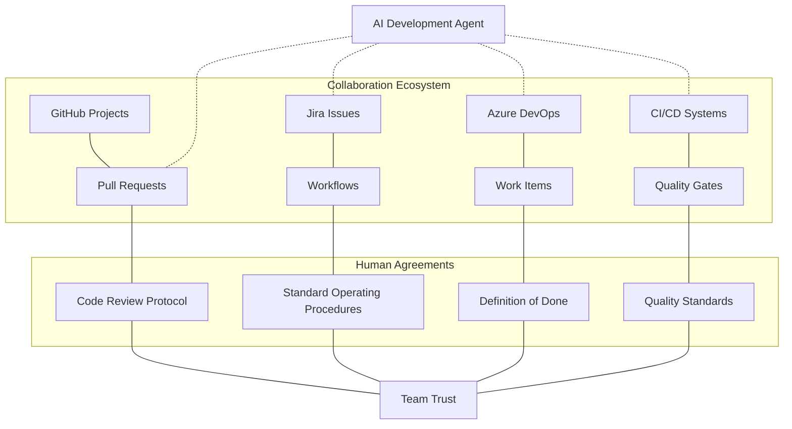
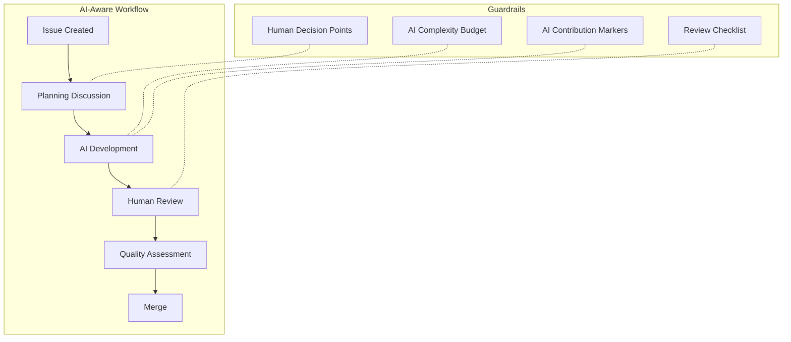

# Integrating AI into Collaboration Platforms and Workflows

## Introduction

Development teams have spent years refining their collaboration processes through platforms like GitHub, Jira, Azure DevOps, and countless others. These systems represent team agreements, process knowledge, and implicit social contracts that maintain coherence across complex projects. 

When AI development agents enter this established ecosystem, they introduce a fundamentally different actor that doesn't inherently understand or respect these sometimes fragile human agreements. By understanding the impact of integrated AI development capabilities, we can introduce the changes into existing collaboration platforms while maintaining team coherence and trust.

## The Collaboration Platform Ecosystem



Before integrating AI into collaboration platforms, teams must understand what these platforms truly represent:

1. **Explicit Agreements** - Documented workflows, quality gates, and approval processes that formalize how work moves through the system.

2. **Implicit Agreements** - Unwritten rules and expectations about how team members interact with the system: the appropriate size of pull requests, the expected level of description in an issue, or when to break a task into smaller units.

3. **Social Contracts** - Trust-based agreements about who can modify what, when escalation is appropriate, and how conflicts are resolved.

AI agents, by their nature, excel at following explicit rules but struggle with implicit agreements and social contracts unless specifically guided.

## Common Disruptions

When AI agents are integrated without consideration for existing team dynamics, several disruptions commonly occur:

### 1. Velocity Imbalances

AI agents can generate code, create issues, request and respond to reviews at superhuman speeds. This creates bottlenecks at human touchpoints like code review and approval processes. Teams experience:

- Overwhelming review queues as AI-generated code outpaces human review capacity
- Pressure to approve changes with less scrutiny to maintain velocity
- Quality degradation as human oversight becomes a formality rather than a careful review

### 2. Metadata Discord

Collaboration platforms rely on consistent metadata—labels, issue types, version tagging, and release cycles. AI agents might:

- Create issues or PRs with incorrect or incomplete metadata
- Misinterpret the appropriate issue type or severity level
- Apply inconsistent labeling patterns
- Miss critical linking between related issues

### 3. Context Fragmentation

Development discussions traditionally happen in issue comments, PR reviews, and dedicated communication channels. AI-generated content often lives outside this ecosystem, leading to:

- Decisions made in AI conversations that aren't captured in the system of record
- Knowledge silos between AI-assisted and traditional development
- Loss of project history and context
- Difficulty tracing why certain decisions were made

### 4. Social Trust Erosion

Perhaps most dangerously, improper AI integration can erode the social trust that underpins successful collaboration:

- Team members may question authorship and accountability
- Review comments may be perceived as less meaningful when addressing AI-generated code
- Knowledge transfer between team members decreases when code is primarily AI-generated
- The sense of shared ownership can diminish

## Integration Principles

Successful integration of AI agents into collaboration platforms follows several core principles:

### 1. Respect Existing Agreements

AI agents should complement rather than bypass existing team agreements. This requires:

- Documenting implicit agreements to make them explicit for AI consumption
- Creating AI-specific guidelines that align with team norms
- Establishing clear boundaries for AI autonomy within collaboration systems

### 2. Maintain Traceability

All AI-generated content should maintain full traceability within collaboration systems:

- Decisions made in AI conversations should be documented in issues or PRs
- AI-generated code should clearly indicate its origin for review purposes
- Rationale for AI-suggested approaches should be captured in the system of record

### 3. Preserve Human Touchpoints

Critical human touchpoints should remain central to the process:

- Architecture decisions should involve human discussion and approval
- Quality gates should maintain human oversight
- Issue prioritization should remain a human-driven activity
- Conflict resolution should always involve human mediation

### 4. Scale Gradually

Integration should follow a gradual scaling approach:

- Begin with limited AI agent involvement in non-critical areas
- Document successes, failures, and learnings at each stage
- Expand AI involvement only after establishing proven patterns
- Create feedback mechanisms to detect and address issues quickly

## Implementation Patterns

### Pattern 1: AI-Aware Workflow Definition



Explicit workflow definitions should account for AI capabilities and limitations:

1. **Define AI-appropriate stages** - Clearly mark which workflow stages can utilize AI assistance and which require human attention.

2. **Establish guardrails** - Create complexity budgets, code size limits, and test coverage requirements for AI-generated code.

3. **Document decision authorities** - Clarify which decisions can be made by AI and which require human approval.

4. **Create AI contribution markers** - Ensure all AI contributions are clearly marked for transparency in review.

**Example Implementation:**
```yaml
# .github/workflows/ai-assisted-development.yml
name: AI-Assisted Development

on:
  issues:
    types: [labeled]

jobs:
  ai_code_generation:
    if: contains(github.event.issue.labels.*.name, 'ai-candidate')
    runs-on: ubuntu-latest
    steps:
      - name: Check AI Eligibility
        run: |
          # Script to verify issue meets AI eligibility criteria
          # - Complexity assessment
          # - Security sensitivity check
          # - Dependency analysis
          
      - name: Generate Implementation
        if: steps.check_ai_eligibility.outputs.eligible == 'true'
        uses: ./.github/actions/ai-code-generation
        with:
          issue-number: ${{ github.event.issue.number }}
          max-complexity: 15
          required-tests: true
          
      - name: Create Draft PR
        run: |
          # Create PR with AI-generated implementation
          # Add "AI-Generated" label and required reviewers
          # Include AI conversation context in PR description
```

### Pattern 2: Hybrid Assignment Model

Development tasks should be explicitly assigned to either human developers, AI agents, or a collaborative pair, with clear accountability:

1. **Triage criteria** - Develop explicit criteria for determining if a task is appropriate for AI assistance.

2. **Assignment tagging** - Use platform-specific tagging to indicate the expected development approach (human, AI, or hybrid).

3. **Accountability mapping** - Clarify which team member is accountable for AI-assisted development.

4. **Review matching** - Pair AI-generated code with reviewers who have appropriate context and expertise.

**Example Implementation:**
```
# Task Assignment Matrix
| Task Type              | Appropriate for AI | Assignment Model    | Accountability    |
|------------------------|-------------------|---------------------|------------------|
| New feature (complex)  | Partial           | Human-led, AI assist| Feature owner    |
| Bug fix (isolated)     | Yes               | AI-led, human review| Bug owner        |
| Refactoring            | Yes               | AI-led, human review| Module owner     |
| Performance improvement| Partial           | Human-led, AI assist| Performance lead |
| Security-related       | No                | Human only          | Security lead    |
```

### Pattern 3: Metadata Governance

Establish explicit governance for how AI interacts with collaboration platform metadata:

1. **Metadata templates** - Create templates for AI to follow when creating issues, PRs, and comments.

2. **Validation hooks** - Implement validation hooks that verify AI-generated metadata before submission.

3. **Auto-correction tools** - Develop tools that automatically correct common AI metadata mistakes.

4. **Feedback loops** - Create mechanisms for humans to train AI on proper metadata usage.

**Example Implementation:**
```python
# pre-commit hook for validating PR metadata
def validate_ai_pr_metadata(pr_data):
    required_fields = ['related-issue', 'test-coverage', 'reviewer', 'complexity-score']
    
    for field in required_fields:
        if field not in pr_data or not pr_data[field]:
            return False, f"Missing required field: {field}"
    
    if not re.match(r'^\d+$', pr_data['related-issue']):
        return False, "Invalid issue reference format"
    
    if pr_data['complexity-score'] > 20:
        return False, "Complexity score exceeds limit for AI-generated code"
        
    return True, "Metadata validation passed"
```

### Pattern 4: Conversation Integration

Link AI development conversations directly to collaboration platforms:

1. **Context linking** - Connect AI conversations to specific issues, PRs, or work items.

2. **Decision extraction** - Automatically extract key decisions from AI conversations to platform records.

3. **Update synchronization** - Sync platform updates into AI conversations to maintain context.

4. **Historical preservation** - Ensure AI conversation history persists alongside platform artifacts.

**Example Implementation:**
```javascript
// Decision extraction from AI conversation
function extractDecisions(conversation) {
    const decisions = [];
    
    for (const message of conversation) {
        // Look for decision markers in the conversation
        if (message.content.includes("DECISION:")) {
            decisions.push({
                decision: message.content.split("DECISION:")[1].trim(),
                context: message.previous_content.slice(-500),
                timestamp: message.timestamp,
                author: message.author
            });
        }
    }
    
    return decisions;
}

// Add decisions to issue or PR
async function addDecisionsToIssue(issueId, decisions) {
    for (const decision of decisions) {
        await addComment(issueId, formatDecisionComment(decision));
        await addLabel(issueId, "ai-decision-recorded");
    }
}
```

## Case Study: Balancing AI Velocity with Human Governance

A middleware development team at a financial services company integrated AI development agents into their GitHub-based workflow. Initially, they allowed the AI to create PRs directly without constraints, quickly overwhelming their review process.

To address this, they implemented several changes:

1. **Velocity Controls**: They implemented a "token-based" system where the AI could have a maximum of 3 open PRs at any time. This prevented review overwhelm.

2. **Context Preservation**: They created a GitHub Action that automatically extracted design decisions from AI conversations and added them as comments to relevant issues.

3. **Metadata Enforcement**: They implemented PR templates specifically for AI-generated code, requiring documentation of:
   - The original issue addressed
   - Key design decisions and alternatives considered
   - Specific areas where human review was most needed
   - Test coverage summary

4. **Social Contracts**: They maintained a "human accountable party" for each AI-generated PR who was responsible for shepherding the code through review and addressing feedback.

The result was a 37% increase in team velocity while maintaining quality standards and team satisfaction. The key insight was treating the AI as a specialized team member bound by the same workflow agreements as humans, rather than as a separate system.

## Implementation Strategy

### For Teams Just Starting with AI

1. **Document Current Workflows**: Before introducing AI, thoroughly document your current collaborative processes, including implicit agreements.

2. **Start Narrow**: Begin with limited areas of AI integration—perhaps generating tests or handling routine bug fixes.

3. **Create Clear Boundaries**: Explicitly define which parts of your workflow are AI-eligible and which are human-only.

4. **Review Tools**: Audit your collaboration tools for AI compatibility and gaps in governance.

### For Teams with Established AI Usage

1. **Conduct Integration Audit**: Review how AI currently integrates with collaboration platforms and identify friction points.

2. **Formalize Agreements**: Create explicit guidelines for AI usage within collaboration systems.

3. **Add Governance Tools**: Implement validation hooks, metadata checkers, and context preservation tools.

4. **Measure Social Impact**: Regularly survey team members about how AI integration affects team dynamics and trust.

## Conclusion

Successful integration of AI development agents into collaboration platforms requires deliberate attention to both technical and social dimensions. By respecting existing team agreements, maintaining traceability, preserving critical human touchpoints, and scaling gradually, teams can harness AI's capabilities while maintaining the collaborative coherence that drives successful software development.

The goal isn't to replace human collaboration with AI efficiency, but to create a hybrid system that augments human capabilities while preserving the social fabric that enables teams to function effectively. Collaboration platforms serve as the connective tissue between human and AI contributors—when this integration is done thoughtfully, it creates a system greater than the sum of its parts.
