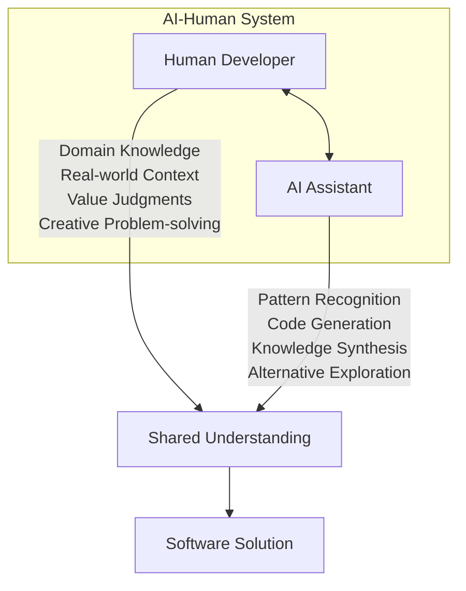
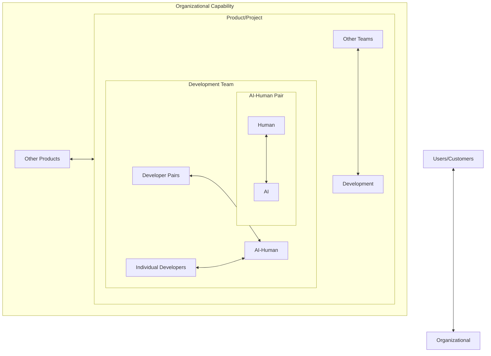
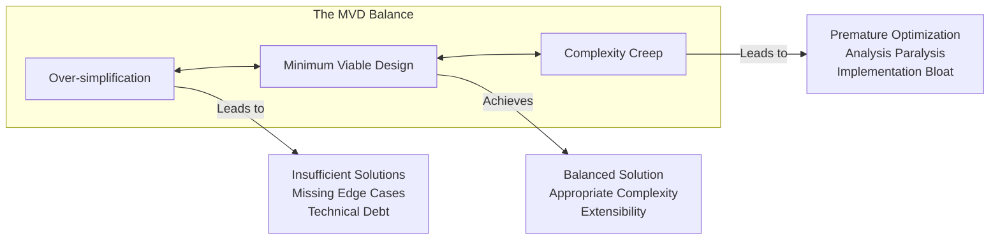
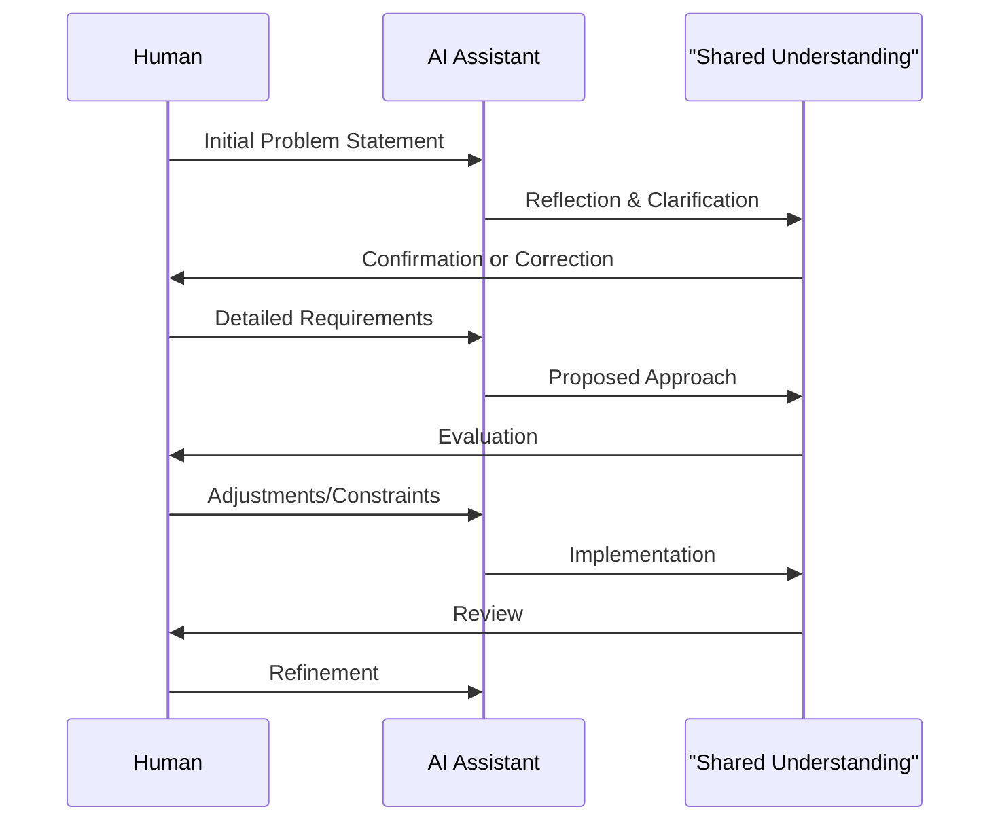
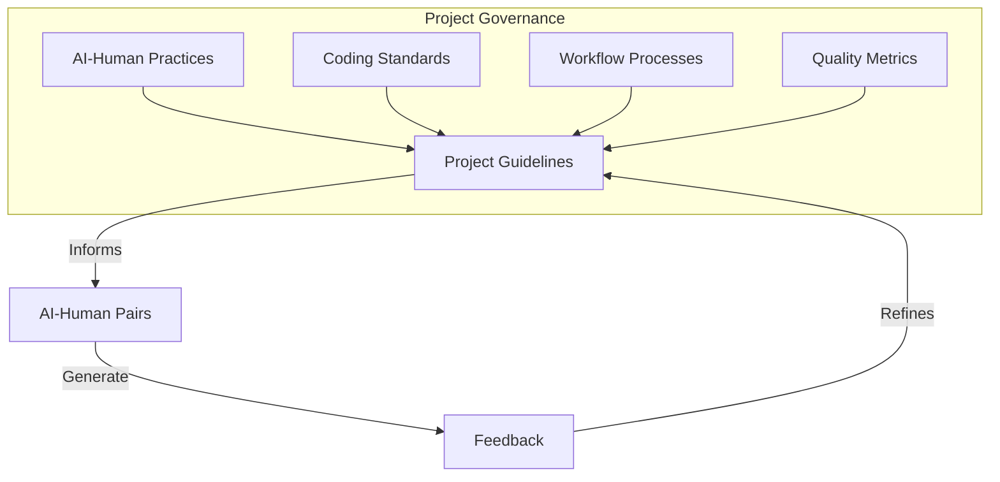
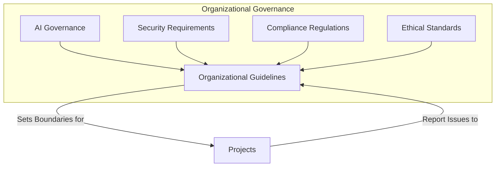
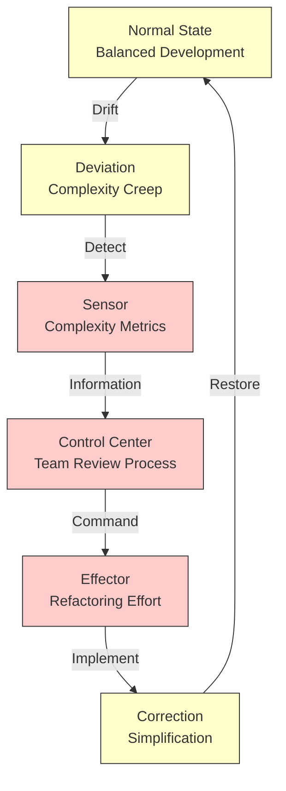
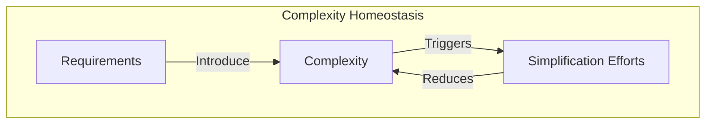
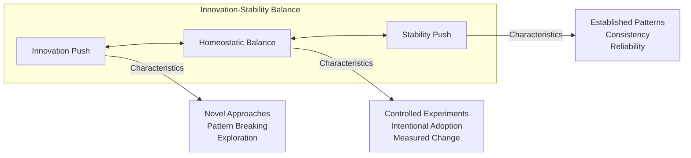
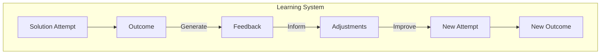

# Systems Thinking for AI-Human Collaboration

## Introduction

When we talk about AI-augmented development, we're describing a different approach to creating software. This approach combines two distinct systems: the human developer with their intuition, experience, and real-world understanding; and the AI assistant with its pattern recognition capabilities and vast knowledge synthesis.

Understanding how to govern and optimize this partnership requires thinking in terms of systems—how they interact, regulate themselves, and evolve together. This document introduces a systems thinking approach to AI-human collaboration, providing a framework for establishing balanced, effective partnerships that create better software while avoiding common traps.

## The AI-Human System

At its core, AI-augmented development represents a synergistic system where the human and AI each contribute their unique strengths:

This partnership forms a "first-order" system—a collaborative unit that converts inputs (requirements, constraints, domain knowledge) into outputs (code, documentation, designs).

This system operates within larger systems of teams, organizations, and user communities.

## Recursive Systems View

The AI-human pair represents one level in a recursive structure of systems:

Each level in this structure requires appropriate governance—patterns, practices and principles that maintain balance, ensure quality, and promote effective collaboration.

## The Principle of Requisite Variety

One fundamental concept in systems theory is the "Law of Requisite Variety," which states that a system can only be controlled if the controlling entity has at least as much variety (range of possible states) as the system being controlled.

In AI-human collaboration, this manifests in several important ways:

1. **Complexity Management**: The development system must have sufficient complexity to handle the problem domain, but not so much that it creates unnecessary overhead.

2. **Balance of Control**: Both the human and the AI should contribute according to their strengths.

3. **Contextual Awareness**: The system needs sufficient context about requirements, constraints, and domain knowledge to generate appropriate solutions.

## Minimum Viable Design

At the heart of effective AI-human collaboration lies the concept of "Minimum Viable Design" (MVD)—a balanced approach that finds the sweet spot between simplicity and complexity. This practical concept directly addresses a common challenge in AI-augmented development.

AI coding assistants often generate solutions at both extremes: naively simple code that ignores edge cases or elaborately complex architectures that far exceed actual requirements. Without clear guidance, developers can find themselves accepting either inadequate solutions or unnecessarily intricate designs.

MVD establishes a middle path by starting with intentional simplicity. As one developer described it: "We changed our mindset to ask 'what's the simplest version that meets our needs right now?'" This approach focuses on current requirements while maintaining awareness of future possibilities.

The defining characteristic of MVD is adding complexity intentionally and only when necessary. One architect shared their practical rule: "We add abstraction only after we have at least three concrete examples that benefit from it." This prevents premature complexity while allowing the system to evolve appropriately.

Regular reassessment forms another vital aspect of MVD. Teams periodically evaluate whether their current implementation matches their actual needs. During one retrospective, a team discovered they had implemented a complex caching solution based on an AI recommendation, but their usage patterns showed a simpler approach would work better. By replacing it, they improved both performance and maintainability.

MVD acknowledges that complexity serves specific purposes. As one senior developer put it: "We embrace complexity when it solves real problems, but require clear justification for its inclusion."

## Regulatory Mechanisms

Effective AI-human systems require regulatory mechanisms—structures and practices that maintain balance and ensure quality. These carefully designed feedback loops keep the system functioning optimally. They operate at multiple levels, each with distinct characteristics and purposes.

### 1. Conversation-Level Regulation

At the conversation level, regulation happens through deliberate interaction patterns between human and AI. The most effective developers establish a rhythm of proposal, evaluation, constraint, and refinement. This rhythm creates natural checkpoints where complexity can be assessed and purpose reconnected.

Explicit decision tracking provides particular value. Skilled developers make decisions explicit: "Let's use a repository pattern here because it will give us more flexibility for changing data sources later." This explicit articulation captures design rationale for future reference, ensures both human and AI understand the decision, and provides an anchor point if the conversation begins to drift from its original purpose.

Periodic complexity checking also plays a crucial role. The human developer regularly asks: "Is this approach becoming more complex than necessary?" AI tools often generate elegant but over-engineered solutions, particularly when requirements lack clarity. By regularly reassessing complexity, developers can redirect the conversation toward simpler approaches when appropriate: "This factory pattern seems too complex for our current needs—let's try a simpler approach first and refactor later if needed."

### 2. Project-Level Regulation

Project-level regulation addresses challenges that emerge when multiple developers use AI tools across a shared codebase. Without coordinated practices, AI-generated code creates inconsistent approaches and quality levels.

Effective project teams establish explicit agreements about AI tool usage. These practical guidelines address observed challenges. For example, one team created a rule: "AI-generated code for public APIs must be reviewed by at least two developers, with particular attention to interface design and backward compatibility." This rule emerged after discovering that AI tools generated overly complex or frequently changing API signatures.

Coding standards need adaptation for the AI era. Traditional standards focus on formatting, naming conventions, and common patterns. AI-specific standards additionally address dependency management ("Prefer existing project dependencies over introducing new ones"), abstraction levels ("Favor explicit code over clever abstractions unless complexity justifies it"), and error handling patterns ("Always use our standard error reporting framework rather than custom error handling").

Most importantly, project-level regulation requires bidirectional flow: guidelines inform individual practice, while experiences from individual practice inform guideline evolution. One team lead established a dedicated Slack channel where developers shared effective (and ineffective) AI interaction patterns. The most valuable patterns gradually became part of the team's documented practices.

### 3. Organizational Regulation

At the organizational level, governance focuses on establishing boundaries that protect both the organization and its stakeholders. Many organizations create generic "AI usage policies" that merely check compliance boxes. Effective organizational regulation instead addresses concrete concerns: How will sensitive data remain protected when shared with AI tools? Which specific code types require human-only development due to security or compliance requirements? What projects have unique constraints that affect AI tool usage?

Organizations with excellent AI governance create bidirectional feedback channels between project teams and governance bodies. When a team discovers an AI tool consistently producing vulnerable code in specific domains, this information flows upward to inform organizational guidelines. Similarly, when AI generates particularly elegant solutions to common problems, these patterns get captured and shared across teams. This flow of information—constraints downward, learnings upward—creates a resilient system capable of adapting to rapidly evolving AI capabilities.

## The Homeostasis Principle

Systems theory introduces homeostasis—a system's ability to maintain internal stability while adjusting to changing external conditions. In AI-human collaboration, homeostasis manifests through specific mechanisms that teams implement in their daily work.

This homeostatic cycle shows how effective teams maintain balance in AI-augmented development. When complexity grows beyond optimal levels (deviation), metrics and reviews (sensors) detect the issue. The team's governance process (control center) triggers targeted refactoring (effector) to simplify the system, restoring it to a balanced state.

### 1. Balanced Complexity

Software systems naturally tend toward increasing complexity. Without counterbalancing forces, this complexity makes systems brittle and unmaintainable. In traditional development, code reviews and refactoring provide these counterbalances. With AI-augmented development, the challenge intensifies because AI tools rapidly generate complex solutions that individually seem elegant but collectively create overwhelming complexity.

Several teams implemented what they called "complexity budgets"—explicit limits on the acceptable complexity for different component types. One architect described their approach: "We established complexity thresholds based on component purpose. Core infrastructure can accommodate higher complexity since senior developers maintain it. User-facing features must stay simpler since they change frequently." When complexity exceeds these thresholds, it triggers deliberate simplification efforts before adding new features.

Another effective approach came from a team that implemented regular "complexity retrospectives." Every two weeks, they identified the most complex parts of their codebase and allocated time specifically for simplification. This regular rhythm prevented complexity from accumulating beyond manageable levels, creating a homeostatic balance that maintained system health.

### 2. Innovation-Stability Balance

AI tools constantly introduce novel approaches, sometimes challenging established patterns. This innovation pressure brings value but must balance against the need for stability and consistency. Without this balance, projects become fragmented collections of clever but incompatible approaches.

The most successful teams establish what one architect called "innovation boundaries"—designated areas where they encourage novel approaches and areas where they prioritize consistency. "We created explicit 'innovation zones' in our architecture where developers could experiment with AI-generated patterns, while keeping our core domain model and public interfaces stable." This compartmentalization created safe spaces for exploration without risking the stability of the entire system.

Some teams implemented "pattern review boards" where developers could propose new approaches discovered through AI collaboration for potential adoption as team standards. This created a formal pathway for innovation to move from individual experiment to team practice, but only after deliberate evaluation.

### 3. Learning Feedback Loops

The most critical homeostatic mechanism is the learning feedback loop. Effective teams learn from each interaction and continuously refine their approach.

One particularly effective practice we observed was "prompt evolution." Teams maintained shared prompt templates for common tasks, but they continuously refined these templates based on outcomes, gradually improving their effectiveness. "We started with basic prompts, but after six months of refinement, our prompts became significantly more effective at guiding the AI toward our project's specific needs," explained one lead developer.

Several teams also implemented structured reviews of AI-generated code that failed in production or required significant rework. They analyzed patterns to identify weaknesses in their AI collaboration approach. "We discovered that certain problem types consistently led to suboptimal AI solutions, so we developed specialized prompting techniques for those specific cases," reported one engineering manager.

## Applying Systems Thinking in Practice

Translating systems theory into practical guidance requires moving beyond abstract principles to concrete actions. Let's examine how systems thinking manifests in daily development practices across different levels of responsibility.

### For Individual Developers

The individual developer-AI pair forms the foundational system in AI-augmented development. At this level, systems thinking manifests in establishing productive feedback loops and boundary conditions.

**Practicing Minimum Viable Design** requires consistently asking "what's the simplest approach that could work?" before implementation. This approach introduces complexity intentionally rather than automatically. When developers ask an AI to generate a solution, they can specify constraints: "Create a user authentication system using our existing database schema with minimal dependencies." These boundaries guide AI tools away from generating unnecessarily complex solutions with excessive abstractions and dependencies.

**Developmental constraints enhance creativity** by focusing problem-solving. One developer shared how adding the constraint "Use only standard library functions, no additional dependencies" to their AI prompts resulted in simpler, more maintainable code that team members understood without learning new frameworks. The constraint pushed both the human and AI to think more deeply about the problem rather than selecting pre-packaged solutions.

Capturing key decisions with their rationale prevents "historical amnesia." One team created a practice of adding "decision notes" to their AI conversations: "Note that we're using a repository pattern here because..." These notes serve as anchors that keep both the AI and the human connected to established decisions as the conversation continues.

### For Team Leads and Managers

Team-level governance addresses velocity imbalance issues. When developers leverage AI to generate code faster than the team can review it, quality suffers. Effective team leads establish "flow control protocols"—practices that match generation velocity to review capacity.

One engineering manager implemented a straightforward practice: limiting developers to one open pull request with AI-generated code at a time. "Until your current AI-assisted PR is reviewed and merged, focus on reviewing others' work instead of generating more code." This constraint dramatically improved code quality by ensuring adequate review attention for each contribution.

Another key practice involves developing AI-specific code review guidelines. Traditional review practices focus on logic errors and edge cases, but AI-generated code requires scrutiny for different issues: unnecessary complexity, reinvention of existing functionality, or inconsistent adherence to project conventions. Several teams reported success with "AI code review checklists" specifically addressing these common AI antipatterns.

Creating space for controlled experimentation helps teams balance innovation and stability. One lead developer established "AI exploration Fridays" where team members experimented with AI-generated approaches to non-critical features. The best patterns from these sessions gradually entered the team's standard practices, while failed experiments provided valuable learning without disrupting production code.

### For Organizations

At the organizational level, governance focuses on creating adaptive frameworks that accommodate diverse projects and evolving AI capabilities.

Organizations need mechanisms to capture and distribute learning between teams. Forward-thinking companies create living repositories of successful practices. One technology director created an internal "AI patterns library" where teams document effective techniques for working with AI tools. "Different domains need different approaches—data processing code benefits from different AI interaction patterns than frontend components."

The most effective organizations establish clear boundaries around sensitive areas while encouraging experimentation elsewhere. Rather than creating general policies about AI use, these organizations specifically identify where AI assistance requires caution: security-critical components, code handling sensitive data, or systems with specific compliance requirements. Outside these boundaries, teams develop their own AI collaboration practices suited to their specific domain.

Creating AI-specific tooling provides substantial leverage. Several organizations developed custom tools that help maintain system balance—code analysis tools that flag potential AI antipatterns, complexity analyzers that prevent excessive abstraction, or documentation generators that capture design decisions. These tools serve as regulatory mechanisms that maintain system health without requiring constant human attention.

## Conclusion: Toward Viable AI-Human Systems

The future of software development requires effective AI-human collaboration, and achieving this potential demands thoughtful systems thinking. Systems thinking directly affects code quality, team productivity, and software project success.

**Minimum viable design** serves as a foundational principle for managing complexity appropriately. Teams that commit to starting with the simplest viable solution avoid the complexity traps that AI tools often create. A senior developer at a healthcare software company explained their practical approach: "Our mantra became 'resist complexity until it proves necessary,'" reflecting a core systems theory principle—that systems should contain only the complexity required to fulfill their purpose.

**Balancing human judgment with AI capabilities** stands as a crucial element of viable systems. The most successful teams with AI tools integrate them thoughtfully rather than extensively. One CTO explained their measurement approach: "We measure success by how effectively our developers leverage AI for appropriate tasks while maintaining human oversight of architecture and design decisions."

**Effective regulatory mechanisms** create the feedback loops that maintain system health. We observed teams evolving their code review practices to address AI-specific concerns, developing metrics focused on maintainability alongside velocity, and creating learning repositories that captured effective practices across projects.

**Adaptability** remains essential as AI capabilities advance rapidly. Resilient teams establish mechanisms for continuous learning—regular retrospectives focused on AI collaboration, evolving prompt libraries based on experience, and governance approaches that adjust to emerging patterns.

Organizations that thrive won't simply adopt AI tools, but will thoughtfully integrate them into systems that maintain balance, adapt to change, and consistently deliver value through human and artificial intelligence working together.

When implementing AI-augmented development practices, consider the systems you're creating and the governance they require. The key insight from the Viable System Model shows that systems need appropriate regulatory mechanisms operating at multiple levels. By applying these principles to AI-human collaboration, we can create development practices that harness AI's potential while preserving the human judgment and creativity that define great software.
